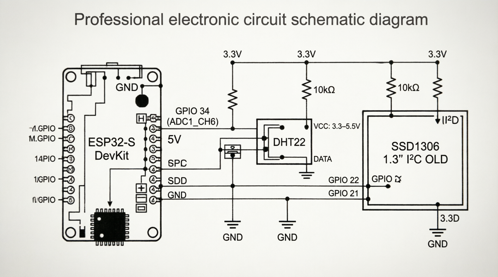
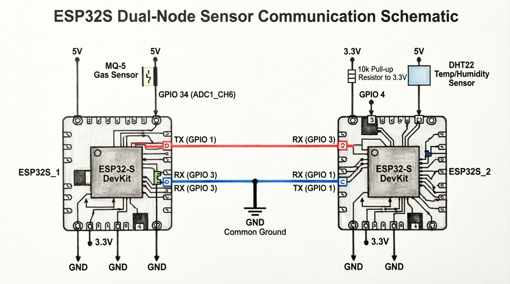
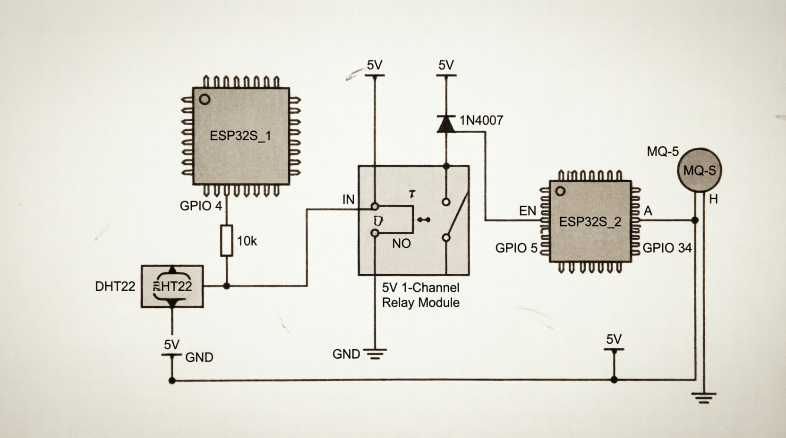

# ICS 4111: Embedded Systems & IoT
## Semester Project: Deliverable 1
### Flora Farms - Rose Greenhouse Monitoring System

**Group Members:** 
150460 - Makau Nathan Maganga
145768 - Ogato Deborah Kerubo
166326 - Muriithi Alvin
169648 - Kamau Joseph Manene
162437 - Ngigi Alex
150320 - Timothy Muigai
150767 - Leon Bundi

**Date:** Tuesday, 9 June 2026

**Assigned Flower:** Rose

---

## 1. Environmental Requirements for Rose Growth

After thorough research, our team has identified the following environmental requirements for optimal rose growth in greenhouse conditions:

| Environmental Parameter | Optimal Range | Unit | Notes |
|------------------------|---------------|------|-------|
| **Temperature Range** | 18-24°C (Day) / 15-21°C (Night) | °C | For most rose varieties, the ideal temperature range is around 18-24°C during the day and 15-21°C overnight (DryGair, n.d.). |
| **Relative Humidity** | 50-80 | % RH | The optimal greenhouse humidity range is between 50% and 80%, with around 80% often cited as optimal for greenhouse cultivation (Ludwig's Roses, n.d.). |
| **Soil Type** | Well-draining, loamy soil | - | Roses require well-drained and nutrient-rich soil for optimal growth (Smithsonian Gardens, n.d.). |
| **Soil Moisture Content** | 40-60 | % volumetric water content | Roses grow best in evenly moist soil. Irrigate when the top 2 inches of soil become dry (The Spruce, n.d.). |
| **Soil pH Range** | 6.0-7.0 (Optimal: 6.5) | pH | The ideal soil pH for growing roses lies between 6.0 and 7.0 (slightly acidic to neutral), with optimal around 6.5 (Rose Society of NSW, n.d.). |
| **Sunlight Exposure** | 6-8 | hours/day | Roses require at least 6 hours of full sun per day, preferably 6-8 hours of direct sunlight, ideally in the morning (New Mexico State University, n.d.). |

### Additional Notes:
- **LPG Monitoring:** Since the greenhouses use LPG heating systems, monitoring for gas leaks (methane, propane, butane) is critical for safety.
- **Temperature Integration:** Lower temperatures may lead to reduced flowering, while temperatures above 35°C can cause roses to cease blooming (New Mexico State University, n.d.).
- **Humidity Control:** High humidity (70-90%) during winter conditions can affect stomatal function and plant health (DryGair, n.d.).

---

## 2. Hardware Components List

Our team has identified the following hardware components required to develop the embedded monitoring system for rose greenhouses:

### 2.1 Core Components

| Component | Quantity | Purpose | Specifications |
|-----------|----------|---------|----------------|
| **ESP32S DevKIT WIFI+ BLE Module (30Pin)** | 1-2 | Main microcontroller unit for data processing and WiFi communication | Dual-core 32-bit MCU, 2.4 GHz Wi-Fi, Bluetooth 5 (LE), 3.3V operating voltage (Espressif Systems, n.d.). |
| **DHT22 (AM2302) Temperature and Humidity Sensor** | 1 | Monitor air temperature and relative humidity in greenhouse | Temperature: -40 to 125°C (±0.5°C), Humidity: 0-100% RH (±2% RH), 3.3-6V DC (Adafruit, n.d.). |
| **MQ-5 LPG Gas Sensor** | 1 | Detect LPG gas leaks (methane, propane, butane) from heating system | Detects LPG, natural gas, coal gas; 200-10000 ppm range; 5V operating voltage (Seeed Studio, n.d.). |
| **1.3" White IIC 128×64 OLED LCD Display** | 1 | Local display of sensor readings and system status | 128×64 pixel resolution, I2C interface, 3.3-5V operation, SSD1306 driver (LCD Wiki, n.d.). |
| **5V 1-Channel Low Level Trigger Relay Module** | 1 | Control external devices (heating system, ventilation) based on sensor data | 5V coil voltage, 10A contact rating, active-low trigger, SPDT configuration (Handson Technology, n.d.). |

### 2.2 Prototyping Tools and Accessories

| Component | Quantity | Purpose |
|-----------|----------|---------|
| **Breadboard (830-point or similar)** | 1-2 | Prototype circuit connections without soldering |
| **Jumper Wires (Male-to-Male, Male-to-Female, Female-to-Female)** | 20-30 | Connect components on breadboard and to ESP32 |
| **Resistors (10kΩ)** | 5-10 | Pull-up resistors for I2C lines and DHT22 data line |
| **Resistors (220Ω, 330Ω)** | 5 | Current limiting for LEDs and other components |
| **USB Cable (Micro-USB or USB-C)** | 1 | Power supply and programming interface for ESP32 |
| **5V Power Supply / Battery** | 1 | Power source for the system (compatible with 12V 100Ah greenhouse battery via regulator) |
| **Voltage Regulator (5V/3.3V)** | 1-2 | Step down 12V battery to 5V and 3.3V for components |
| **Capacitors (100nF, 10µF)** | 5-10 | Power supply decoupling and filtering |
| **Multimeter** | 1 | Test voltages, continuity, and troubleshoot circuits |
| **Wire Stripper/Cutter** | 1 | Prepare wires for connections |

### 2.3 Additional Sensors (Optional for Enhanced Monitoring)

| Component | Quantity | Purpose |
|-----------|----------|---------|
| **Soil Moisture Sensor (Capacitive type)** | 1-2 | Monitor soil moisture content for irrigation control |
| **Soil pH Sensor** | 1 | Monitor soil pH levels |
| **Light Intensity Sensor (BH1750 or similar)** | 1 | Measure sunlight exposure in greenhouse |
| **Water Flow Sensor** | 1 | Monitor irrigation water usage from river stream |

---

## 3. Component Datasheets

Our team has retrieved the following datasheets and technical documentation for all major components:

### 3.1 ESP32S DevKIT WIFI+ BLE Module
- **Datasheet Links:** [Espressif Official Documentation](https://docs.espressif.com/projects/esp-dev-kits/en/latest/esp32/esp32-devkitc/index.html) (Espressif Systems, n.d.); [SparkFun Datasheet](https://cdn.sparkfun.com/datasheets/IoT/esp32_datasheet_en.pdf) (SparkFun Electronics, n.d.)
- **Key Specifications:** Operating Voltage: 2.7V - 3.6V (typical 3.3V); Wi-Fi: 2.4 GHz; Bluetooth: BLE 4.0; GPIO Pins: 30+; ADC: 12-bit SAR ADC up to 18 channels.

### 3.2 DHT22 (AM2302) Temperature and Humidity Sensor
- **Datasheet Links:** [Adafruit Datasheet](https://cdn-shop.adafruit.com/datasheets/Digital+humidity+and+temperature+sensor+AM2302.pdf) (Adafruit, n.d.)
- **Key Specifications:** Power Supply: 3.3V - 6V DC; Temperature Range: -40°C to 125°C (±0.5°C); Humidity Range: 0-100% RH (±2% RH); Output: Digital signal.

### 3.3 MQ-5 LPG Gas Sensor
- **Datasheet Links:** [Seeed Studio Technical Data](https://files.seeedstudio.com/wiki/Grove-Gas_Sensor-MQ5/res/MQ-5.pdf) (Seeed Studio, n.d.); [Winsen Datasheet](https://www.winsen-sensor.com/d/files/MQ-5.pdf) (Winsen Electronics, n.d.)
- **Key Specifications:** Operating Voltage: DC 5V; Detection Range: 200-10000 ppm; Sensitive Gases: LPG, natural gas, town gas; Output: Analog voltage (0-5V).

### 3.4 1.3" White IIC 128×64 OLED LCD Display
- **Datasheet Links:** [LCD Wiki Manual](https://www.lcdwiki.com/1.3inch_IIC_OLED_Module_SKU:MC130VX) (LCD Wiki, n.d.)
- **Key Specifications:** Resolution: 128×64 pixels; Interface: I2C; Driver IC: SSD1306/SH1106; Operating Voltage: 3.3V - 5V DC.

### 3.5 5V 1-Channel Low Level Trigger Relay Module
- **Datasheet Links:** [Handson Technology Datasheet](https://handsontec.com/dataspecs/relay/1Ch-relay.pdf) (Handson Technology, n.d.)
- **Key Specifications:** Coil Voltage: 5V DC; Contact Rating: 10A at 250VAC / 30VDC; Trigger Signal: Low level trigger (active-low); Optical Isolation: Yes.

---

## 4. Schematic Diagrams

Our team has developed three different schematic architectures based on the specified components. Each design serves different monitoring and control scenarios for the rose greenhouse.

### 4.1 Architecture A: Single ESP32S with All Sensors

**Description:**  
This architecture uses a single ESP32S microcontroller connected to the MQ-5 gas sensor, DHT22 temperature/humidity sensor, and 1.3" OLED display. This is the simplest and most cost-effective design.

**Connections:**
| Component | Pin | ESP32S Pin | Additional Components |
|-----------|-----|------------|----------------------|
| MQ-5 Gas Sensor | AOUT | GPIO 34 (ADC1_CH6) | - |
| DHT22 Sensor | DATA | GPIO 4 | 10kΩ pull-up resistor to 3.3V |
| OLED Display | SCL | GPIO 22 | 10kΩ pull-up resistor to 3.3V |
| OLED Display | SDA | GPIO 21 | 10kΩ pull-up resistor to 3.3V |

**Advantages:** Simple wiring, cost-effective, lower power consumption.  
**Disadvantages:** Single point of failure, limited GPIO availability.

---

### 4.2 Architecture B: Dual ESP32S with UART Communication

**Description:**  
This architecture uses two ESP32S microcontrollers communicating via UART serial communication. ESP32S_1 handles the MQ-5 gas sensor, while ESP32S_2 manages the DHT22 sensor.

**Connections:**
- **ESP32S_1 (Gas Node):** MQ-5 AOUT to GPIO 34. TX (GPIO 1) to ESP32S_2 RX (GPIO 3).
- **ESP32S_2 (Climate Node):** DHT22 DATA to GPIO 4 (with 10kΩ pull-up). TX (GPIO 1) to ESP32S_1 RX (GPIO 3).
- **Common:** Shared GND.

**Advantages:** Distributed processing, modular design, scalability.  
**Disadvantages:** Higher cost, complex programming, requires synchronization.

---

### 4.3 Architecture C: Relay-Controlled Dual ESP32S System

**Description:**  
This advanced architecture uses a relay module to control power/enablement of the second ESP32S based on DHT22 sensor readings from the first ESP32S, enabling power management.

**Connections:**
- **ESP32S_1 (Primary):** DHT22 DATA to GPIO 4. GPIO 4 also connected to Relay IN.
- **Relay Module:** VCC to 5V, GND to GND, IN to ESP32S_1 GPIO 4. NO (Normally Open) terminal connected to ESP32S_2 EN pin. 1N4007 flyback diode placed across the relay coil.
- **ESP32S_2 (Secondary):** MQ-5 AOUT to GPIO 34. EN pin controlled by Relay NO terminal.

**Control Logic:** When temp/humidity exceeds thresholds, ESP32S_1 pulls GPIO 4 LOW, activating the relay. The relay closes the NO contact, enabling ESP32S_2 to wake up and monitor gas.

**Advantages:** Energy efficient, extends battery life, intelligent power management.  
**Disadvantages:** Most complex design, continuous gas monitoring not possible.

---

## 5. Power Supply Considerations

Given that the Flora Farms greenhouses are solar-powered with 200W solar panels and a 12V 100Ah battery setup, our embedded system must be compatible with this power infrastructure.

### Power Requirements Calculation:

| Component | Voltage | Current (Typical) | Power |
|-----------|---------|-------------------|-------|
| ESP32S (active) | 3.3V | 80mA | 264mW |
| DHT22 (measuring) | 3.3V | 2.5mA | 8.25mW |
| MQ-5 (with heater) | 5V | 150mA | 750mW |
| OLED Display | 3.3V | 12mA | 39.6mW |
| Relay Module (active) | 5V | 70mA | 350mW |

**Total System Power (Architecture A - All active):** ~1.4W  
**Daily Energy Consumption (24h operation):** ~33.6 Wh/day

This is well within the capacity of the 12V 100Ah battery (1200 Wh capacity) and can be easily sustained by the 200W solar panels.

### Voltage Regulation:
To step down from the 12V battery to required voltages:
- **12V → 5V:** Use LM7805 or a buck converter (more efficient).
- **5V → 3.3V:** Use AMS1117-3.3 or a buck converter.
- **Recommendation:** Use DC-DC buck converters for higher efficiency (85-95%) compared to linear regulators.

---

## 6. Team Collaboration Evidence

### Group Meeting Minutes

**Meeting 1:** [Date]  
**Attendees:** [List all members]  
**Topics Discussed:** Initial research on rose growing requirements, component selection, and task distribution.

**Meeting 2:** [Date]  
**Attendees:** [List all members]  
**Topics Discussed:** Review of datasheets, component compatibility, and schematic diagram design discussions.

**Meeting 3:** [Date]  
**Attendees:** [List all members]  
**Topics Discussed:** Final review of all three architectures, documentation compilation, and submission preparation.

### Task Distribution

| Team Member | Responsibilities |
|-------------|------------------|
| [Member 1] | Research on rose environmental requirements, temperature and humidity monitoring |
| [Member 2] | Component datasheet collection, MQ-5 gas sensor research |
| [Member 3] | Schematic diagram design (Architecture A and B), power calculations |
| [Member 4] | Schematic diagram design (Architecture C), documentation formatting |
| [All Members] | Group discussions, design reviews, final document review |

### Group Photo

---

## 7. References

Adafruit. (n.d.). *DHT22/AM2302 digital humidity and temperature sensor datasheet*. https://cdn-shop.adafruit.com/datasheets/Digital+humidity+and+temperature+sensor+AM2302.pdf

DryGair. (n.d.). *How to grow roses – Rose greenhouse guide*. https://drygair.com/blog/rose-greenhouse/

Espressif Systems. (n.d.). *ESP32-DevKitC documentation*. https://docs.espressif.com/projects/esp-dev-kits/en/latest/esp32/esp32-devkitc/index.html

Handson Technology. (n.d.). *1 channel 5V relay module datasheet*. https://handsontec.com/dataspecs/relay/1Ch-relay.pdf

LCD Wiki. (n.d.). *1.3inch IIC OLED module (SKU: MC130VX)*. https://www.lcdwiki.com/1.3inch_IIC_OLED_Module_SKU:MC130VX

Ludwig's Roses. (n.d.). *Conditions that suit roses*. https://www.ludwigsroses.co.za

New Mexico State University. (n.d.). *Growing roses* (Guide H-165). https://pubs.nmsu.edu/_h/H165/

Rose Society of NSW. (n.d.). *Soil improvement and the importance of pH*. https://nsw.rose.org.au

Seeed Studio. (n.d.). *MQ-5 gas sensor technical data*. https://files.seeedstudio.com/wiki/Grove-Gas_Sensor-MQ5/res/MQ-5.pdf

Smithsonian Gardens. (n.d.). *Tips for growing healthy roses*. https://gardens.si.edu/learn/blog/tips-for-growing-healthy-roses/

SparkFun Electronics. (n.d.). *ESP32 datasheet*. https://cdn.sparkfun.com/datasheets/IoT/esp32_datasheet_en.pdf

The Spruce. (n.d.). *Preparing garden soil for growing roses*. https://www.thespruce.com/soil-for-roses-1403048

Winsen Electronics. (n.d.). *MQ-5 flammable gas sensor datasheet*. https://www.winsen-sensor.com/d/files/MQ-5.pdf

---

## 8. Conclusion

Our team has successfully completed Deliverable 1 for the Flora Farms rose greenhouse monitoring project. We have researched and documented the environmental requirements for rose growth, identified all necessary hardware components, retrieved datasheets, and developed three distinct schematic architectures (Single ESP32S, Dual ESP32S with UART, and Relay-Controlled Dual ESP32S). We have also calculated power requirements and confirmed compatibility with the greenhouse's solar and battery infrastructure.

The next steps for our project will involve prototyping the chosen architecture, developing the firmware for sensor data acquisition, and implementing WiFi connectivity for cloud communication.

---

**Document Prepared By:** 150460 - Makau Nathan Maganga  
**Reviewed By:** 145768 - Ogato Deborah Kerubo, 166326 - Muriithi Alvin, 169648 - Kamau Joseph Manene, 162437 - Ngigi Alex, 150320 - Timothy Muigai, 150767 - Leon Bundi 
**Submission Date:** Tuesday, 9 June 2026
